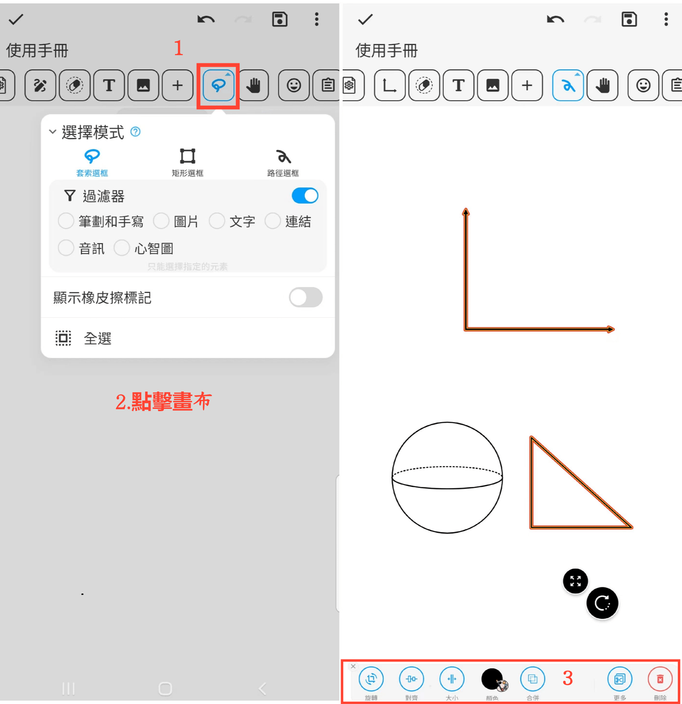

[使用手冊](/dragonnest/drawnote/manual/zh) > [超級筆記](/dragonnest/drawnote/manual/zh/super_note) >

選擇模式
---
选择模式提供多种选框方式

- 套索選框-選中選擇框形成的封閉區域內的元素。

- 矩形選擇框-選取矩形範圍內的元素。

- 路徑選擇框-選擇路徑覆蓋的元素。
#### 操作步驟

1.點擊工具列中的“選擇模式”按鈕，選擇所需選擇框方式。

2.點擊畫布，滑動選擇需要編輯的內容，可以是單個或多個元素。

3.對選中元素執行旋轉、放大、縮小、顏色、合併、剪切、刪除等操作。

#### 提示
在多個元素重疊時，可打開過濾器以精確選擇特定內容，提高管理和整理效率。