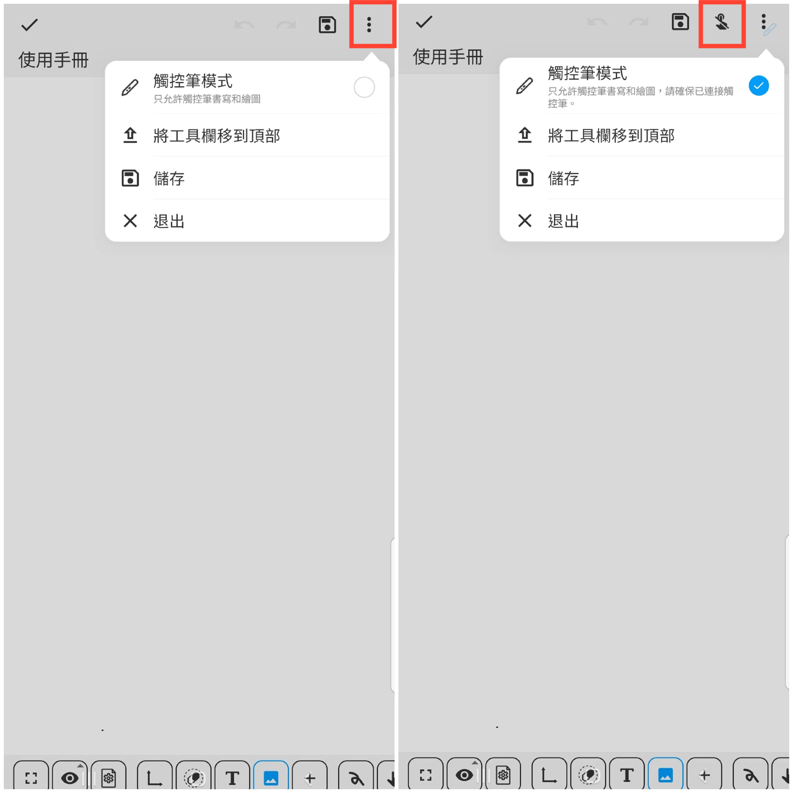

[使用手冊](/dragonnest/drawnote/manual/zh-tw) > [超級筆記](/dragonnest/drawnote/manual/zh-tw/super_note) >

觸控筆模式
---
#### 操作步驟

在超級筆記頁面，點擊螢幕右上方的“⋮”更多按鈕，勾選觸控筆模式即可。

#### 提示
- 進入觸控筆模式前，請確保已成功連接上觸控筆。
- 進入觸控筆模式後，頁面頂部將展示一個“禁止手指觸摸”的按鈕，您可以點擊該按鈕以防止手指誤觸。