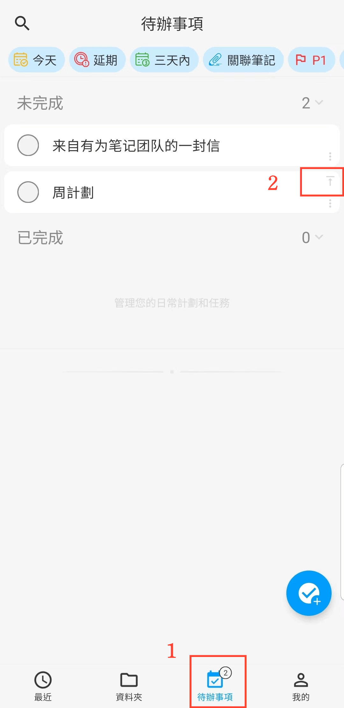
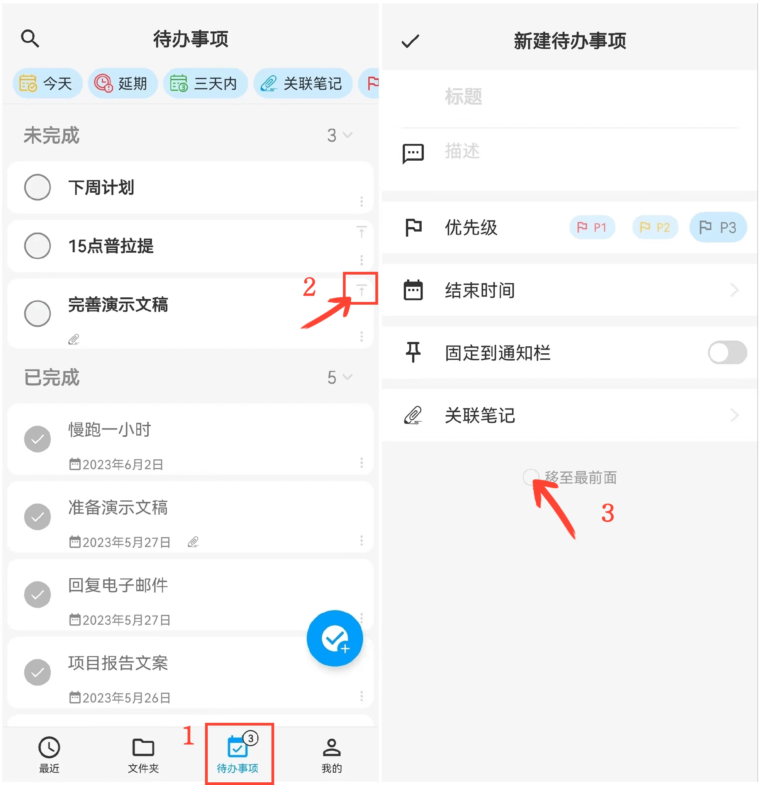

[使用手冊](/dragonnest/drawnote/manual/zh) > [待辦事項清單](/dragonnest/drawnote/manual/zh/to_do) >

新增
待辦事項
---
#### 操作步驟

1. 在「待辦事項」頁面

2. 點擊“+”按鈕。

3. 輸入標題、描述等信息。

4. 點擊左上角的確認按鈕，即可新增一個待辦事項。

#### 提示
1. 待辦事項計數 - 在底部標籤欄處，會顯示目前未完成的任務數量。

2. 置頂待辦事項 - 在「待辦事項」頁面，點擊某一事項右上角的“置頂”按鈕，將重要事項移到頂部。

3. 移至最前面 - 在“新增
待辦事項”頁面，點擊底部的“移至最前面”按鈕，將任務置於頂部。

