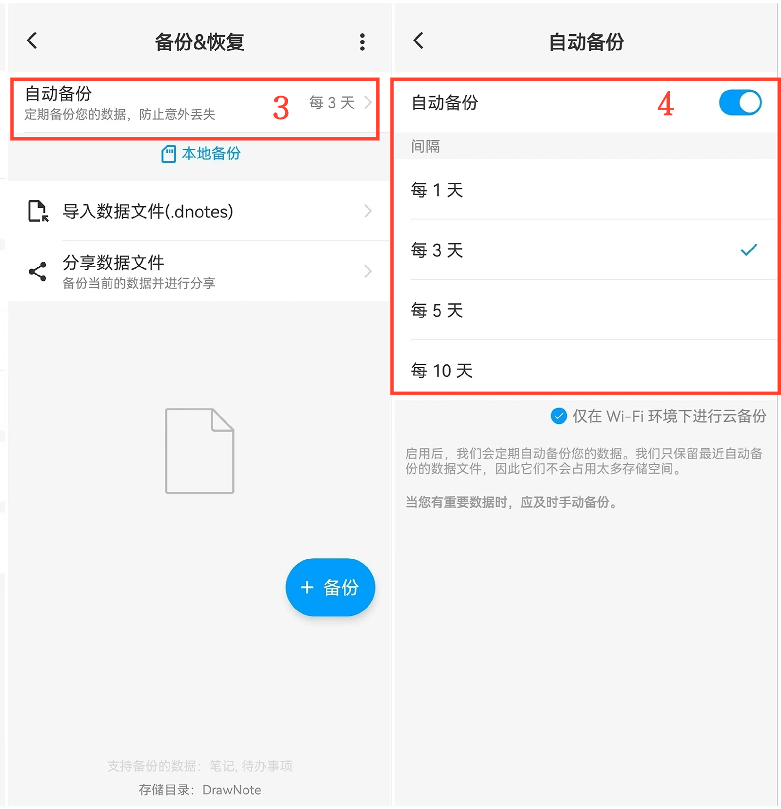

[用户手册](/dragonnest/drawnote/manual/zh) > [数据备份和恢复](/dragonnest/drawnote/manual/zh/data_backup_and_recovery) >

自动备份
---
#### 操作步骤

1.在主页面点击「我的」。

2.进入“备份&恢复”选项。

3.点击"自动备份"选项。

4.打开 "自动备份"按钮并选择备份间隔时间，以保护数据和应对意外情况。

