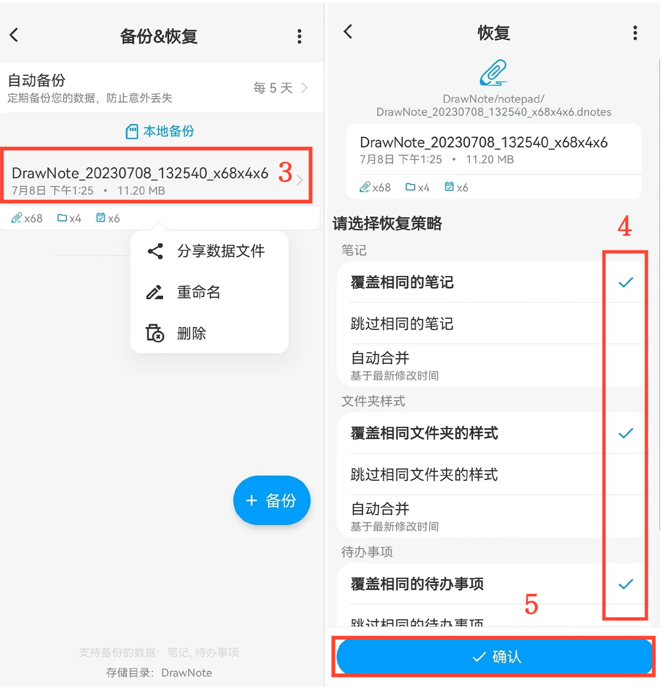

[用户手册](/dragonnest/drawnote/manual) > [数据备份和恢复](/dragonnest/drawnote/manual/data_backup_and_recovery) >

数据恢复
---
#### 操作步骤

1.在主页面点击「我的」。

2.进入“备份&恢复”选项。

3.单击文件条以选择备份文件。

4.勾选适当的选项

5.点击确认，以恢复数据。

#### 提示
备份数据恢复时，有以下三种策略可供选择：
- 覆盖相同的笔记-将备份内容替换当前笔记。
- 跳过相同的笔记-当备份内容与当前笔记相同时，当前笔记保持不变。
- 自动合并-基于最新修改时间合并备份和现有笔记。

根据需求选择合适策略，并定期备份以防数据丢失。