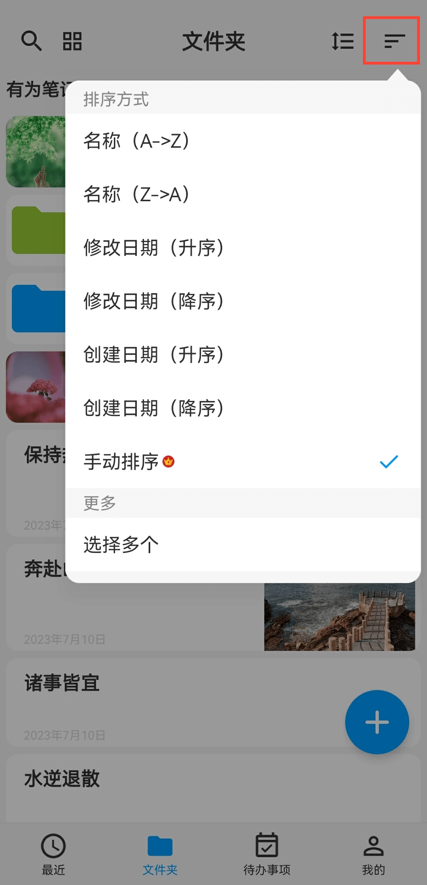
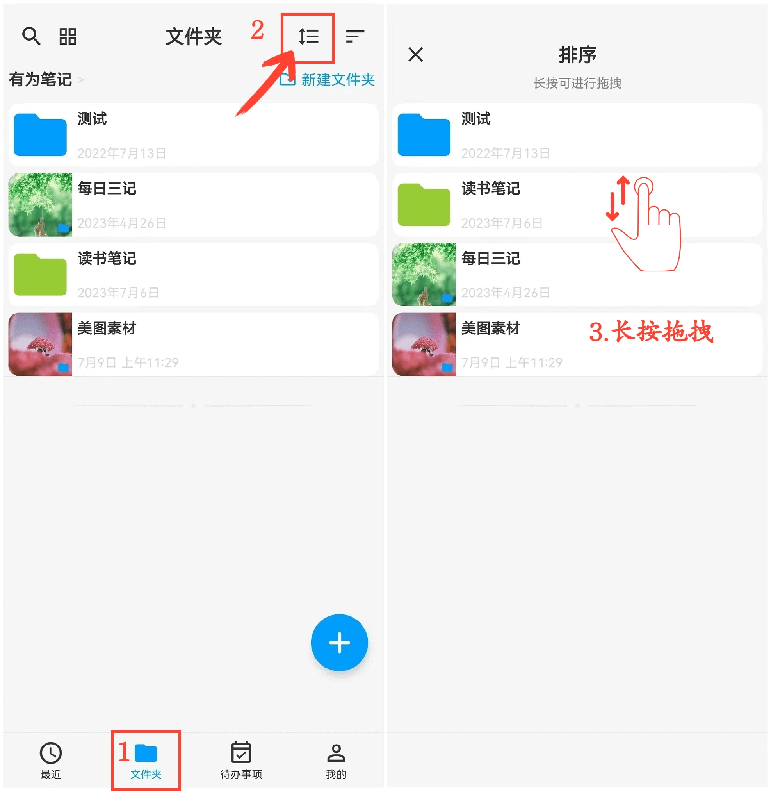

[用户手册](/dragonnest/drawnote/manual/zh) > [文件夹](/dragonnest/drawnote/manual/zh/folder) >

文件夹排序
---
文件排序有多种方式，您可用名称、修改日期、创建日期等方式进行排序，也可以手动排序。

#### 选择排序方式
在「文件夹」页面，点击"排序方式"按钮，选择你需要的排序方式。

#### 手动排序
1.在「文件夹」页面。

2.点击"排序"按钮。

3.长按并上下拖拽，以调整排列顺序。

