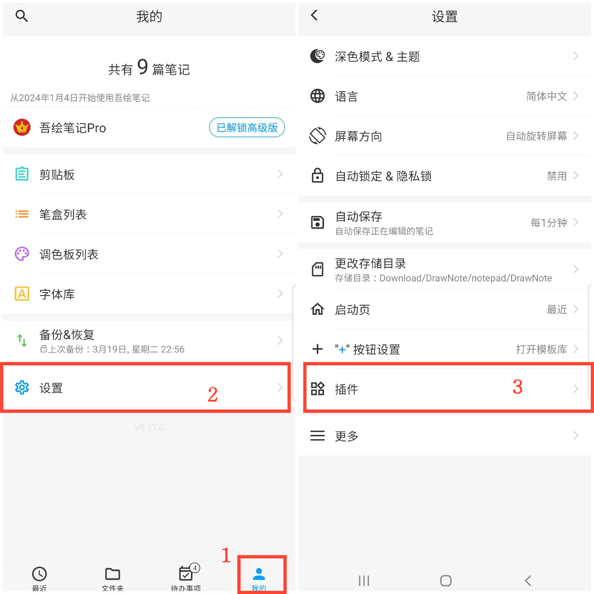
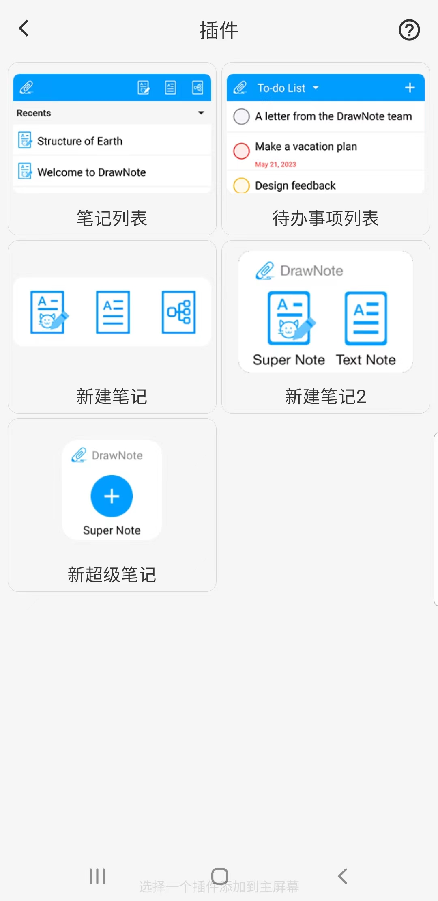

[用户手册](/dragonnest/drawnote/manual/zh) > [更多](/dragonnest/drawnote/manual/zh/more) >

### 添加插件
---
通过在设备主屏幕上添加桌面插件，您可以方便快捷地访问笔记编辑功能，无需打开应用程序。

### 操作步骤
1. 在主屏幕上点击「我的」。
2. 进入设置。
3. 点击"插件"，选择要添加的插件类型。

