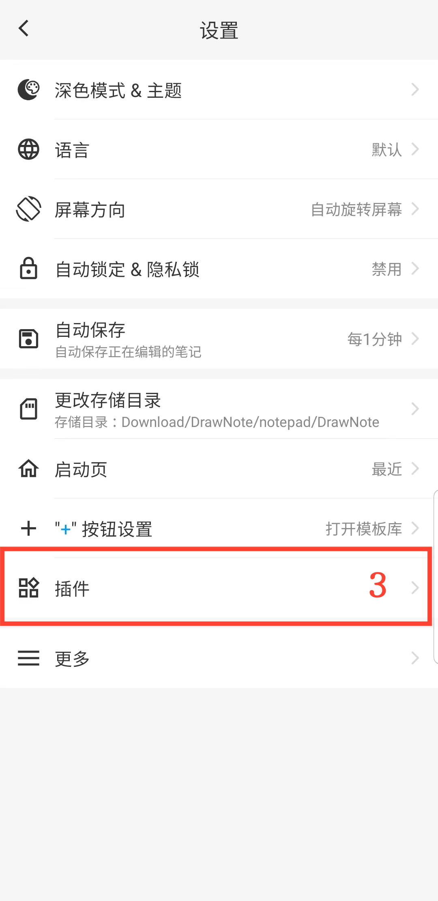

[用户手册](/dragonnest/drawnote/manual/zh) > [更多](/dragonnest/drawnote/manual/zh/more) >

添加桌面小插件
---
通过添加桌面小插件到您的设备主屏幕，您可以方便快捷地访问笔记编辑功能，而无需打开应用程序。
### 操作步骤
1. 在主屏幕上点击「我的」。
2. 进入设置。
3. 点击"插件"，选择要添加的插件类型。

#### 提示
您也可以直接在设备桌面进入添加小插件设置，找到该应用程序，然后添加桌面小插件。

