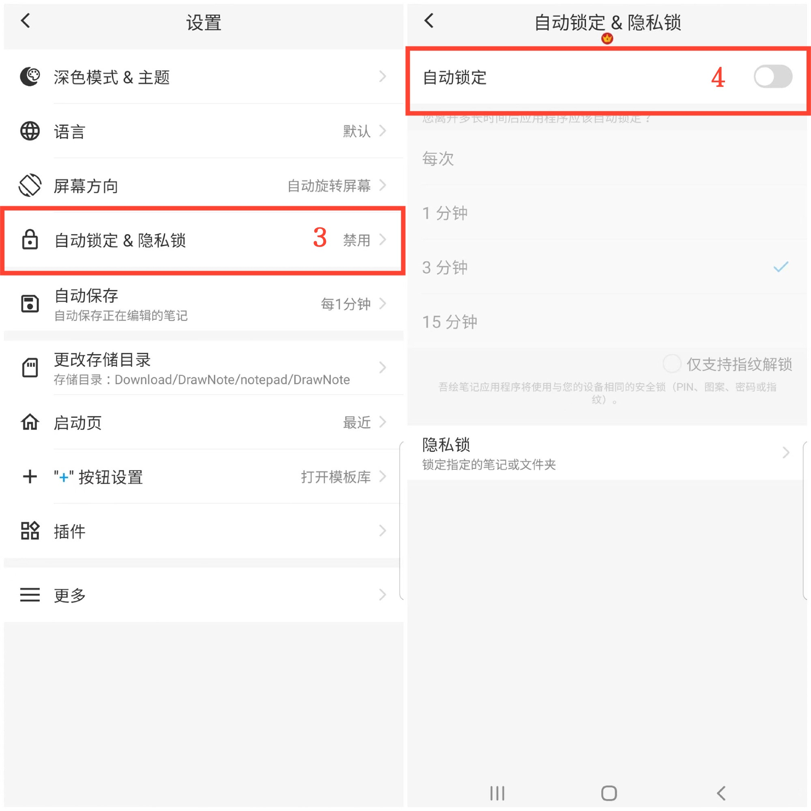
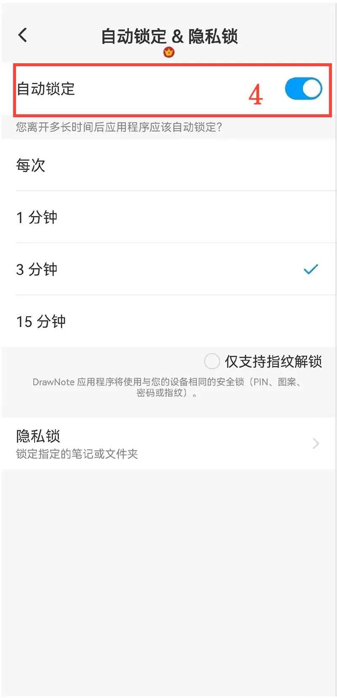

[用户手册](/dragonnest/drawnote/manual/zh) > [更多](/dragonnest/drawnote/manual/zh/more) >

自动锁定
---
自动锁定是指应用程序会在您离开一段时间后自动锁定，以增加隐私和数据安全，防止未经授权的访问。
#### 操作步骤

1.点击主页的「我的」。

2.进入设置。

3.点击"自动锁定&隐私锁"。

4.打开"自动锁定"按钮，选择自动锁定时间。

