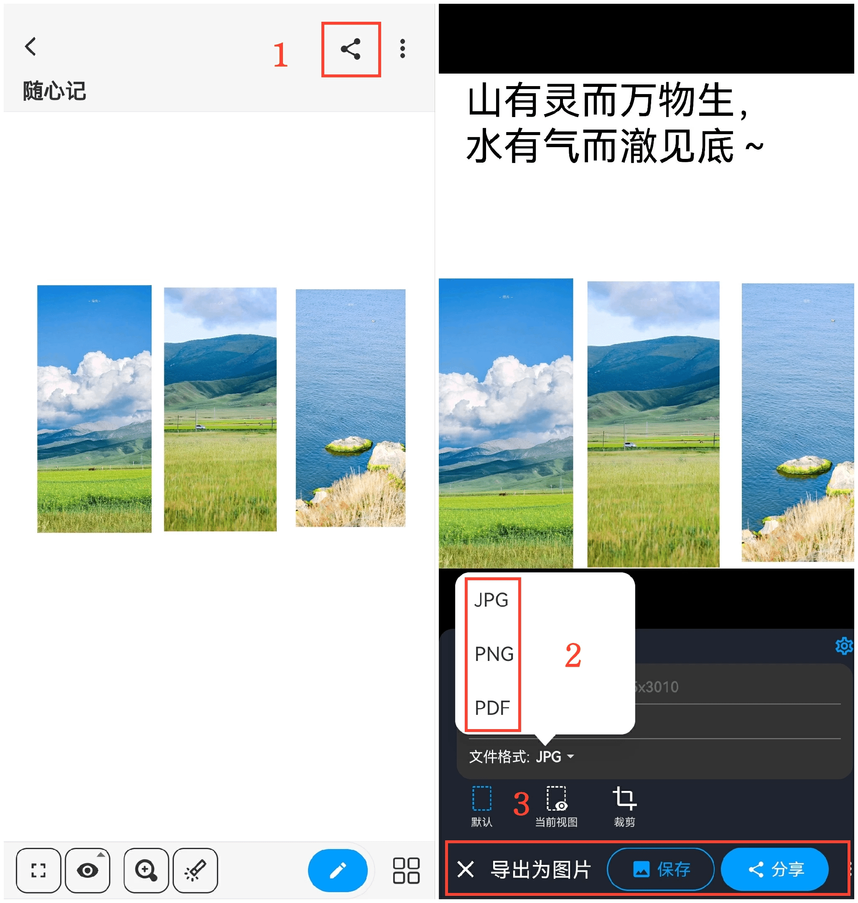
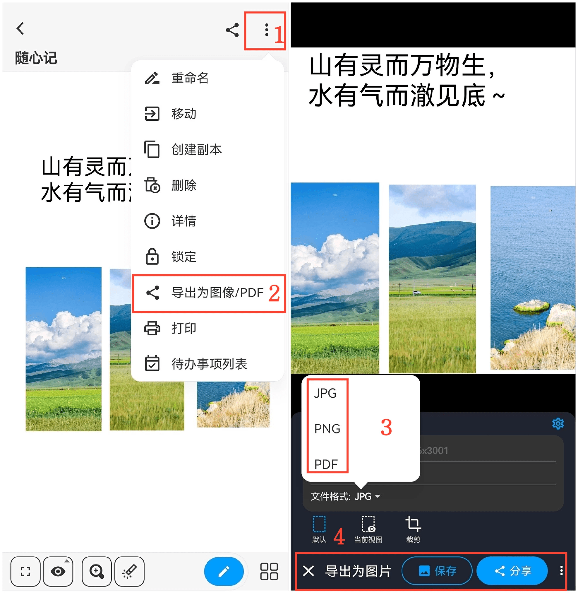

[用户手册](/dragonnest/drawnote/manual/zh) > [更多](/dragonnest/drawnote/manual/zh/more) >

导出/分享笔记
---
有两种方法可以导出/分享笔记。

#### 方法一
1.在阅读模式下，点击画布右上角的“分享”图标。

2.选择您希望导出的笔记文件格式。

3.选择“保存”或“分享”，然后选择分享途径，完成操作。

#### 方法二
1.在阅读模式下，点击右上方的“⋮”更多图标。

2.选择“导出为图像/PDF”。

3.选择您希望导出的笔记文件格式。

4.点击“保存”或“分享”，然后选择分享途径，完成操作。

