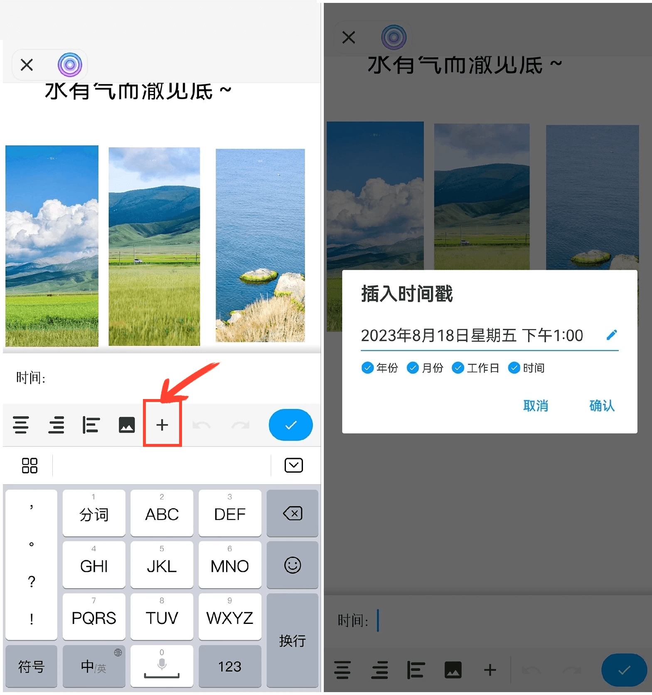

[用户手册](/dragonnest/drawnote/manual) > [更多](/dragonnest/drawnote/manual/more) >

插入时间戳
---
插入时间戳可以方便地记录笔记的时间。

#### 操作步骤
在文字笔记中，向左滑动点击“+”号，选择“插入时间戳”，点击确认，即可。

在超级笔记和思维导图中需选中文字，打开文字菜单栏，然后向左滑动点击“+”号，选择“插入时间戳”，点击确认。

