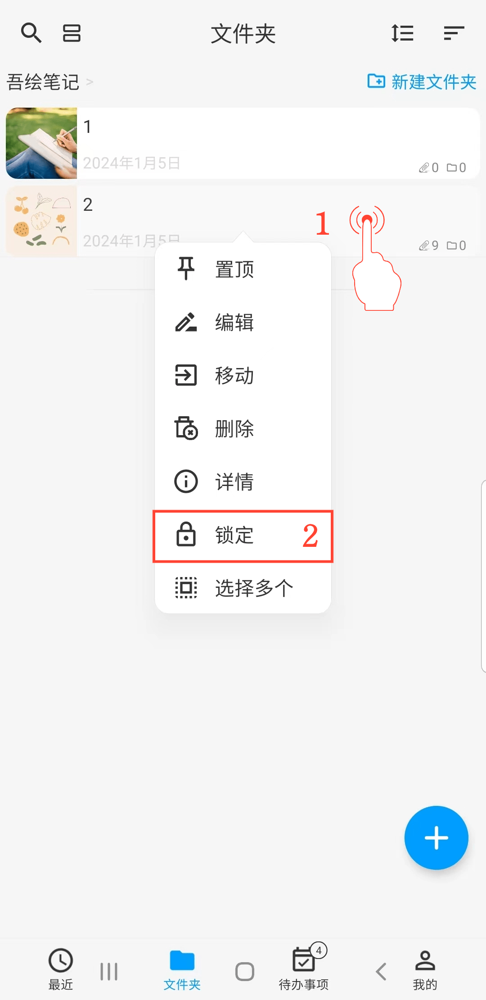

[用户手册](/dragonnest/drawnote/manual/zh) > [更多](/dragonnest/drawnote/manual/zh/more) >

隐私锁
---
通过隐私锁，您可以锁定指定的笔记和文件夹。
#### 操作步骤

1.长按需要锁定/解锁的笔记或文件夹。

2.在弹出的菜单栏中点击“锁定“/”解锁”，即可锁定/解锁笔记或文件夹。

#### 提示
- 锁定的内容无法直接搜索。

- 在「我的」，"自动锁定&隐私锁"界面，您可设置隐私锁指纹解锁或者密码解锁。

- 隐私锁是一种本地临时锁定机制。这意味着，当您对笔记进行加锁并将其备份后，然后在其他设备上恢复这些笔记时，并不需要再次解锁即可查看其内容。