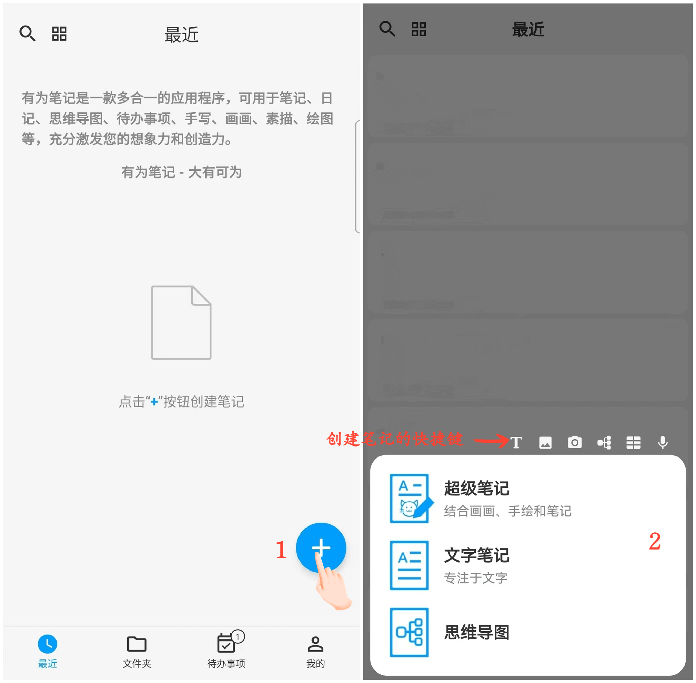

[User Manual](/dragonnest/drawnote/manual/zh) >

Creating New Notes
---
Provides various flexible types of notes, including Super Notes, Text Notes, and Mind Maps, to meet different usage scenarios.

- Super Notes - Merge handwritten, drawings, text, images, recordings, tables, mind maps, and other elements together, utilizing a flexible canvas to fully express your creativity and artistic talent.

- Text Notes - Focus on text recording, supporting rich text formatting and image insertion, making your notes more diverse and visual.

- Mind Maps - Help you quickly capture ideas and organize knowledge, presenting complex concepts with clear graphical structures.

#### Steps

On the application's homepage, click the "+" icon in the bottom right corner, choose the type of note you want to create, and begin your creative process.

#### Tips

- When creating a new note by clicking the "+ button" in the "Folders" section, the new note will automatically be categorized under the current folder.

- You can also utilize the quick access shortcuts in the menu at the top to quickly access different creative features of Super Notes.