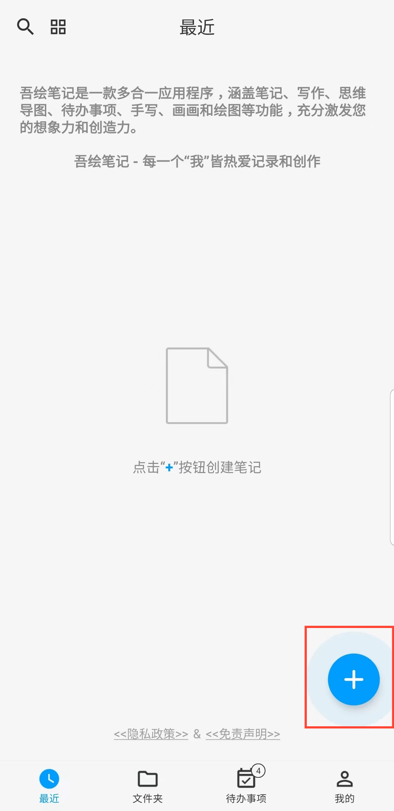
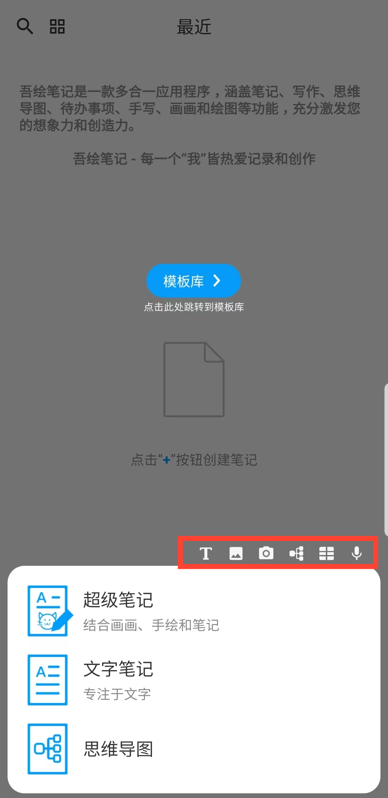

[用户手册](/dragonnest/drawnote/manual/zh) > 

新建笔记
---
吾绘笔记提供多种灵活的笔记类型，包括超级笔记、文字笔记和思维导图，以满足不同的使用场景。

- 超级笔记 - 将手写、绘图、文字、图片、录音、表格、思维导图等元素融合在一起，利用灵活的画布充分表达您的创意和艺术才华。

- 文字笔记 - 专注于文字记录，支持富文本设置以及插入图片，让您的记录更具多样性和可视化。

- 思维导图 - 帮助您迅速捕捉想法并整理知识，以清晰的图形结构展现复杂的概念。
#### 操作步骤

在应用首页，点击右下角的“+”图标，选择要创建的笔记类型，开始创作。

#### 提示

- 在「文件夹」处点击“+”按钮新建笔记时，新笔记将自动分类至当前文件夹。

- 您还可以利用菜单顶部的快捷入口，快速进入超级笔记的不同功能创作界面。

