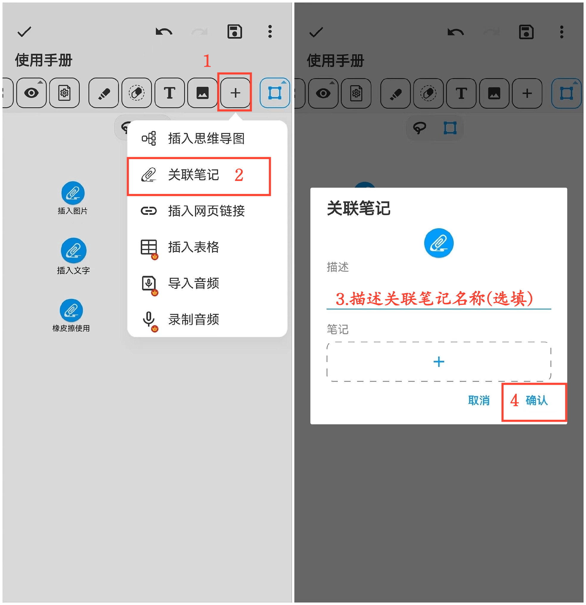

[用户手册](/dragonnest/drawnote/manual/zh) > [超级笔记](/dragonnest/drawnote/manual/zh/super_note) >

关联笔记
---

关联笔记功能让您轻松连接相关笔记，提升笔记组织和查找效率。
#### 操作步骤

1.在工具栏中点击“+”按钮。

2.点击“关联笔记”，选择要关联的笔记。

3.为关联笔记命名（可选）。

4.点击“确认”，即可将需要关联的笔记添加到当前笔记中。

#### 提示

- 为关联笔记命名有助于更快地查找和管理。

- 利用“时间顺序”或“文件夹”筛选可更快地选取笔记。