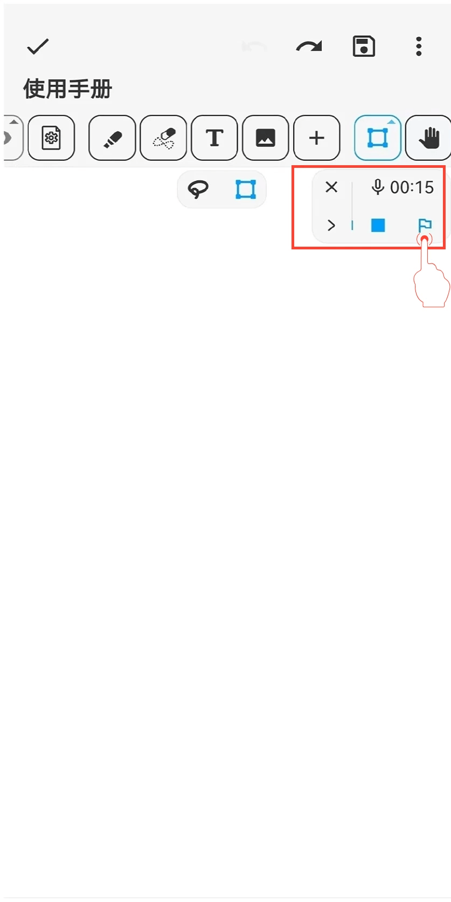
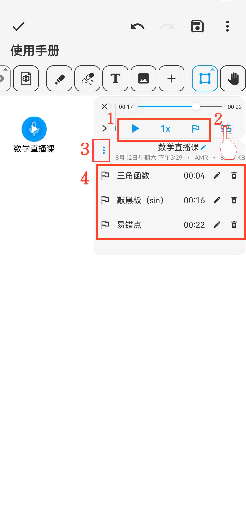

[用户手册](/dragonnest/drawnote/manual/zh) > [超级笔记](/dragonnest/drawnote/manual/zh/super_note) >

音频标记
---
音频标记类似于书签，可在录制或重听音频时帮助您快速定位和重复关键部分。

#### 操作步骤

在录音或播音时，点击“标记”按钮可插入当前时间的标记。

#### 提示

1.**调整音频速度和添加标记** - 在工具栏中轻松完成。

2.**修改录音和标记名称** - 点击右侧的“≡”按钮，然后点击“画笔”按钮。

3.**下载音频** - 点击左侧的“⋮”按钮即可下载。

4.**查看音频标记记录** - 在展开菜单中查看标记，点击标记即可快速跳转播放音频。

