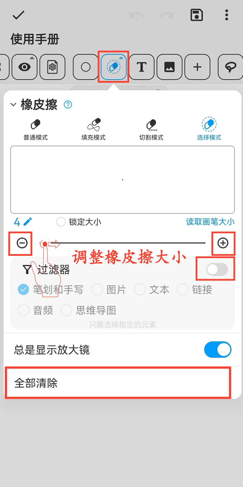

[用户手册](/dragonnest/drawnote/manual) > [超级笔记](/dragonnest/drawnote/manual/super_note) >

橡皮擦
---
橡皮擦功能针对各种使用场景提供了多个模式
#### 操作步骤

点击工具栏中的“橡皮擦”按钮。

- 普通模式-采用遮罩技术，真实地模拟橡皮擦效果。可擦除各种元素，如线条、文本和图片。此模式会生成擦除标记，允许用户选择已擦除的元素。

- 填充模式-与普通模式相似，但可以迅速擦除扇形区域。

- 切割模式-将元素切割成多个独立部分，仅适用于线条和部分几何图形。此模式擦除后不留痕迹。

- 选择模式-直接删除选中的整体元素，并支持设置过滤条件。此模式擦除后无痕迹。

#### 提示
- 点击“全部清除”可清空整个画布。
