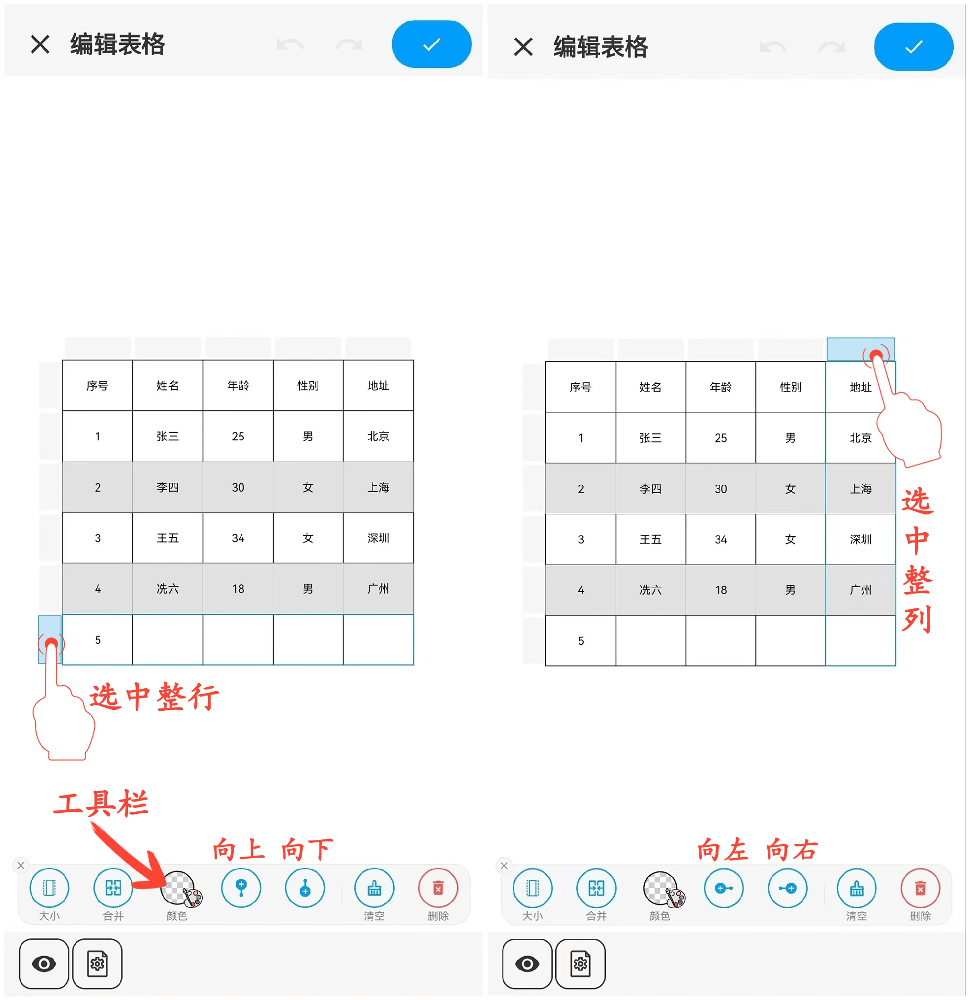
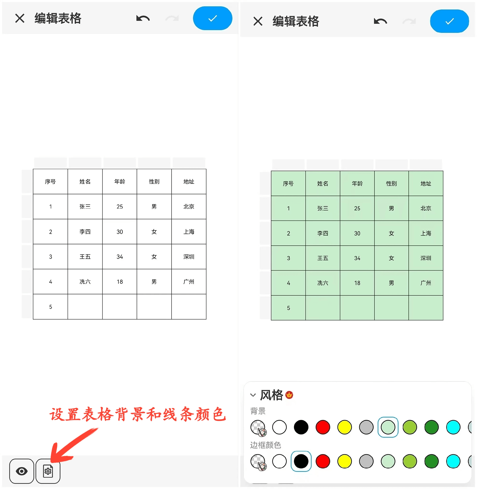

[用户手册](/dragonnest/drawnote/manual/zh) > [超级笔记](/dragonnest/drawnote/manual/zh/super_note) >

插入表格
---
#### 操作步骤

1.在工具栏中点击“+”号按钮。

2.选择“插入表格”，即可将表格添加到您的笔记中。

#### 提示
- 设置单元格数量 - 滑动或输入数字，选择所需的单元格数量。

- 调整表格宽度和高度 - 滑动尺寸拉条或输入数字，设置单元格的默认尺寸。

- 编辑单元格格式 - 选中单元格后，您可以设置其大小、颜色，还可以清空内容。

- 编辑单元格文字格式 - 选中单元格后，可编辑文字内容和格式，包括颜色、字号、加粗、下划线和对齐方式。

- 设置整行或整列格式 - 选中行或列后，可对单元格进行合并、背景色设置、内容清空等操作。

- 插入整行或整列 - 选中行或列后，点击“插入”按钮，即可插入新的行或列。

- 设置表格外观 - 点击画布左下角的“设置”按钮，在菜单中，设置表格的背景色和边框颜色。

