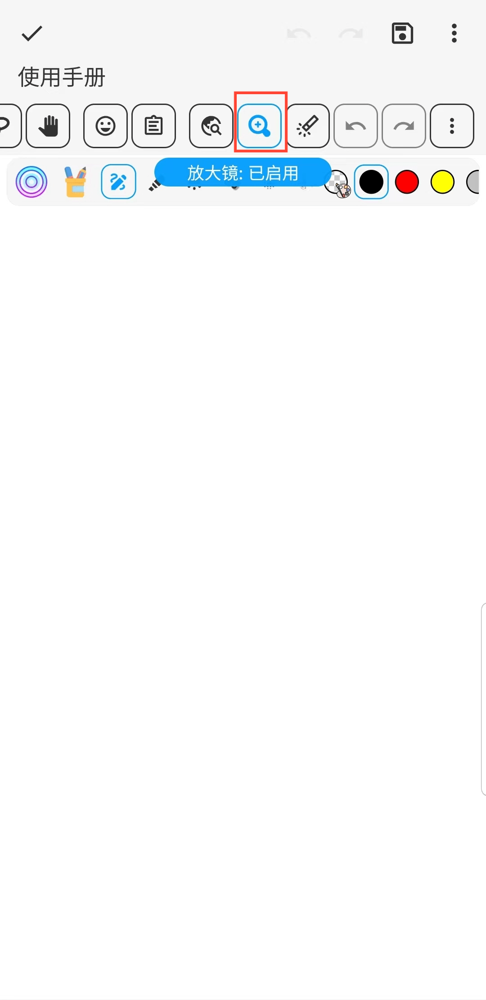

[用户手册](/dragonnest/drawnote/manual/zh) > [超级笔记](/dragonnest/drawnote/manual/zh/super_note) >

放大镜
---
放大镜功能可以帮助您更方便地查看和编辑笔记内容，特别是在处理小字体或精细图形时。它能够放大文本和图片，并提供准确定位以及便捷操作。

#### 操作步骤

在超级笔记页面，点击工具栏的放大镜按钮，即可。

