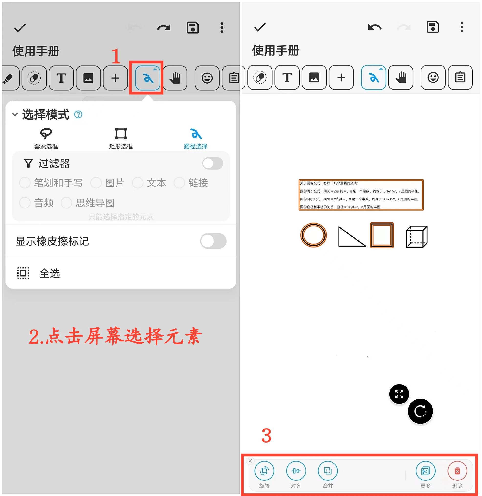

[用户手册](/dragonnest/drawnote/manual/zh) > [超级笔记](/dragonnest/drawnote/manual/zh/super_note) >

选择模式
---

选择模式提供多种选框方式

- 套索选框-选中套索形成的封闭区域内的元素。

- 矩形选框-选取矩形范围内的元素。

- 路径选框-选择路径覆盖的元素。
#### 操作步骤

1.点击工具栏中的“选择模式”按钮，选择所需选框方式。

2.点击画布，滑动选择需要编辑的内容，可以是单个或多个元素。

3.对选中元素执行旋转、放大、缩小、合并、剪切、删除等操作。

#### 提示
在多个元素重叠时，可打开过滤器以精确选择特定内容，提高管理和整理效率。