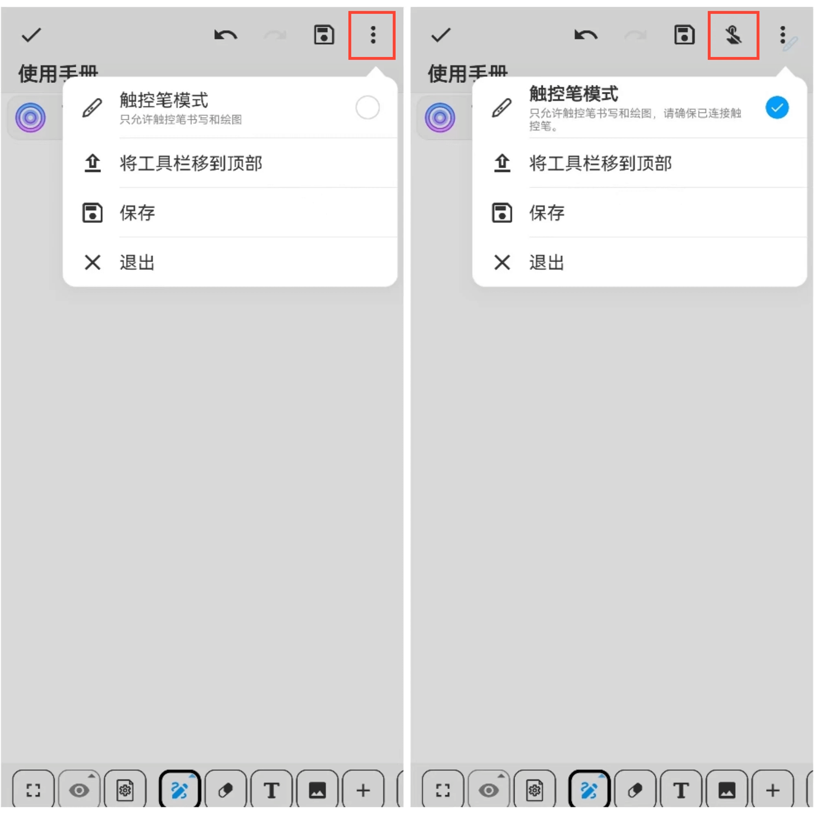

[用户手册](/dragonnest/drawnote/manual/zh) > [超级笔记](/dragonnest/drawnote/manual/zh/super_note) >

触控笔模式
---
#### 操作步骤

在超级笔记页面，点击屏幕右上方的“⋮”更多按钮，勾选触控笔模式即可。

#### 温馨提示：
- 进入触控笔模式前，请确保已成功连接上触控笔。
- 进入触控笔模式后，页面顶部将展示一个“禁止手指触摸”的按钮，您可以点击该按钮以防止手指误触。