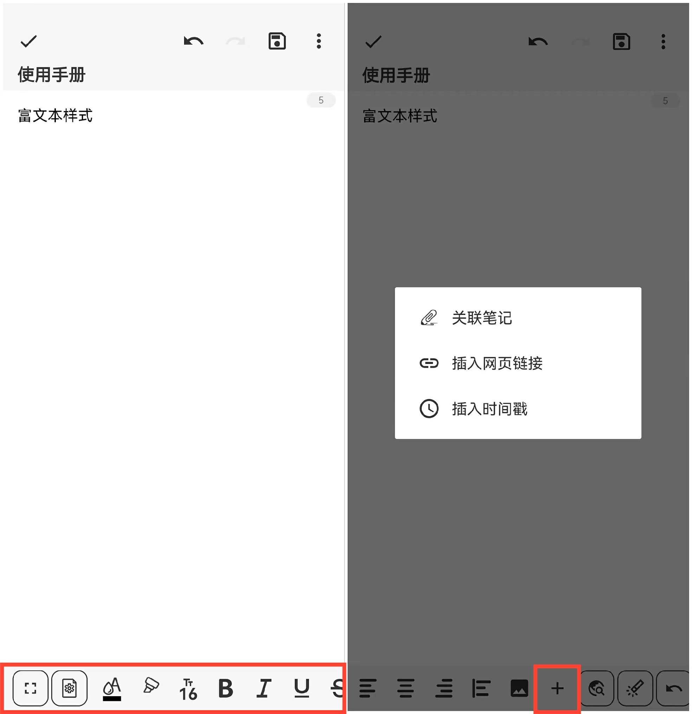

[用户手册](/dragonnest/drawnote/manual/zh) > [文字笔记](/dragonnest/drawnote/manual/zh/text_note) >

富文本样式
---

文字笔记的富文本样式功能提供更多样化的文本编辑体验。

除了轻松记录文字外，您还可以自定义字体颜色、字号、加粗、斜体、下划线等样式。

此外，我们还提供了快捷输入功能，如插入链接、插入时间戳、插入图片等，以提高编辑效率。

