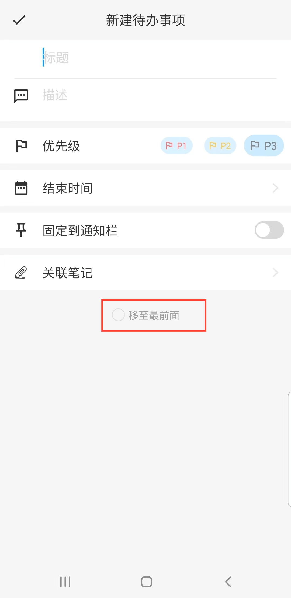

[用户手册](/dragonnest/drawnote/manual/zh) > [待办事项清单](/dragonnest/drawnote/manual/zh/to_do) >

新建待办事项
---
#### 操作步骤

1.在「待办事项」页面

2.点击“+”按钮。

3.输入标题、描述等信息。

4.点击左上角的确认按钮，即可新增一个待办事项。

#### 提示
1.待办事项计数 - 在底部标签栏处，会显示当前未完成的任务数量。

2.置顶待办事项 - 在「待办事项」页面，点击某一事项右上角的“置顶”按钮，将重要事项移到顶部。

3.移至最前面 - 在“新建待办事项”页面，点击底部的“移至最前面”按钮，将任务置于顶部。

